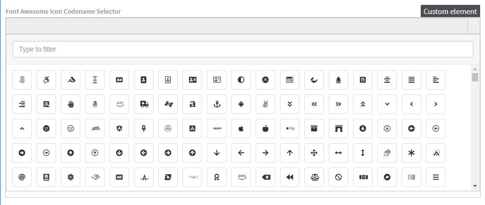

# Font Awesome Icon Codename Selector

[](https://stackoverflow.com/tags/kentico-kontent)
[](https://app.netlify.com/sites/kontent-custom-element-font-awesome-selector-codename/deploys)


## A custom element for Kentico Kontent

This is a [custom element](https://docs.kontent.ai/tutorials/develop-apps/integrate/integrating-your-own-content-editing-features) for [Kentico Kontent](https://kontent.ai) that allows you to pick [Font Awesome Icon](https://fontawesome.com/icons).



The custom element is storing the **code of the picked icon**. Internally it is a wrapper over the [fontawesome-iconpicker](https://github.com/itsjavi/fontawesome-iconpicker) selector.

:bulb:

If you want to take a look to another approach that stores *icon SVG*, take a look to the sibling repository [kontent-custom-element-font-awesome-selector-svg](https://github.com/Simply007/kontent-custom-element-font-awesome-selector-svg).

## Stored value

```json
{
  ...
  "elements": {
      "custom_element": {
        "type": "custom",
        "name": "Custom element",
        "value": "fas fa-arrow-circle-right"
      }
    }
  ...
},
```

## Setup

1. Deploy the code to a secure public host
    * See [deploying section](#Deploying) for a really quick option
1. Follow the instructions in the [Kentico Kontent documentation](https://docs.kontent.ai/tutorials/develop-apps/integrate/integrating-your-own-content-editing-features#a-3--displaying-a-custom-element-in-kentico-kontent) to add the element to a content model.
    * The `Hosted code URL` is where you deployed to in step 1
    * No JSON parameters are necessary

## Deploying

Netlify has made this easy. If you click the deploy button below, it will guide you through the process of deploying it to Netlify and leave you with a copy of the repository in your GitHub account as well.

[](https://app.netlify.com/start/deploy?repository=https://github.com/Simply007/kontent-custom-element-font-awesome-selector-codename)

### Development

You can use following to set up the development environment

Prerequisites:

* Node.js
* git
* [ngrok](https://ngrok.com/)

```sh
npm i -g serve
git clone https://github.com/Simply007/kontent-custom-element-font-awesome-selector-codename
cd kontent-custom-element-font-awesome-selector-codename
serve . # serving the index.html locally on http://localhost:5000
ngrok # forwarding the request using ngrok proxy - see actual url in console output
```

---

## Team

This project was part of [Kentico Kontent](https://kontent.ai) Consulting and DevRel hackaton!

| <br /><sub>Ondřej Chrastina</sub><br/>[Github](https://github.com/Simply007)<br/>[Twitter](https://twitter.com/ChrastinaOndrej) | <br/><sub>Richard Šustek</sub><br/>[Github](https://github.com/enngage)<br/> &nbsp; | <br/><sub>Yuriy Sountsov</sub><br/>[Github](https://github.com/yuriys-kentico)<br/>[Twitter](https://twitter.com/sountsov) | <br/><sub>Rui Wang</sub><br/>[Github](https://github.com/RuiRayWang)<br/>[Twitter](https://twitter.com/ChrastinaOndrej) |
| :---: | :---: | :---: | :---: |
